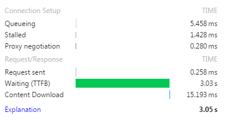
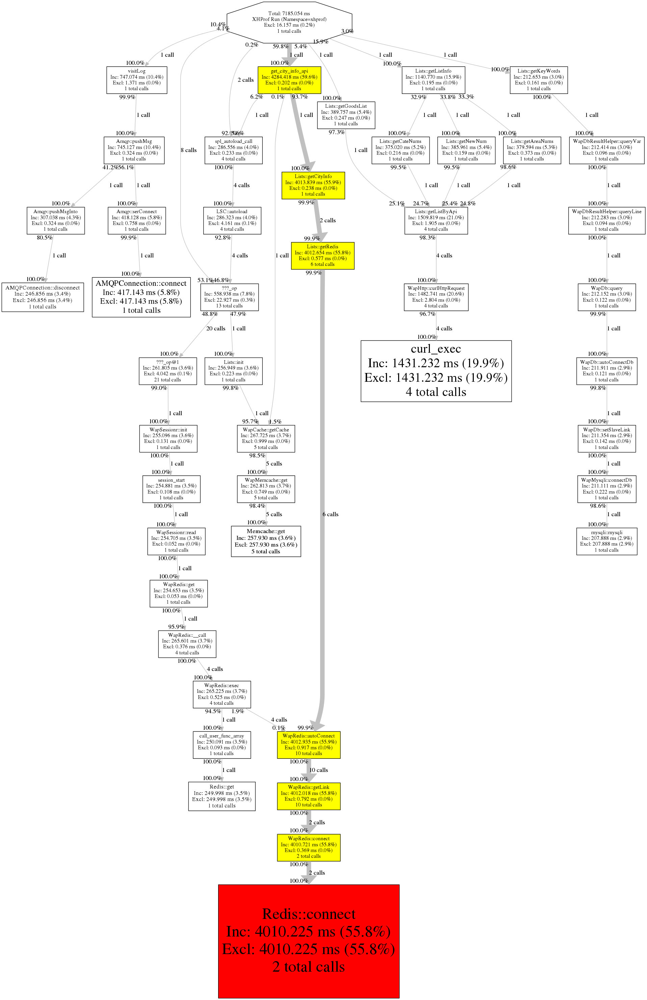

title: "使用Xhprof检测PHP性能短板"
date: 2015-09-08 10：44：10
tags:
- PHP
- 性能
- Xhprof
categories: 
---

## 起因

最近的一个项目，在别人的基础上修改的，代码checkout出来之后，部署好，访问一看，愣是等了几秒钟才出现页面：



问题到底出在哪儿呢？

由于这个项目新接手，并不知道其中的具体业务逻辑。而且代码错综复杂，在发现使用 xdebug 单步调试不知道何时才能发现影响性能的关键因素之后我发现了这个：

**[Xhprof](https://pecl.php.net/package/xhprof)**

## 介绍

先看介绍

> XHProf is a function-level hierarchical profiler for PHP and has a simple HTML based navigational interface. The raw data collection component is implemented in C (as a PHP extension). The reporting/UI layer is all in PHP. It is capable of reporting function-level inclusive and exclusive wall times, memory usage, CPU times and number of calls for each function. Additionally, it supports ability to compare two runs (hierarchical DIFF reports), or aggregate results from multiple runs.

再看效果图：



好直观有木有！

## 用法

简单说下用法：

### 安装

下载并编译php扩展

```shell
wget http://pecl.php.net/get/xhprof-0.9.4.tgz
tar zxvf xhprof-0.9.4.tgz
cd xhprof-0.9.4/extension/
sudo phpize
./configure --with-php-config=/usr/local/php/bin/php-config
sudo make
sudo make install
```

由于Xhprof提供的是Web界面，这里需要将xhprof解压到Web能够访问的目录下。

### 配置

编辑php.ini

```shell
extension=xhprof.so;
xhprof.output_dir=/share/xhprof
```

上面的 `xhprof.output_dir` 配置项配置了xhprof生成性能分析文件的地方

配置好后不免要重启Apache或php-fpm

## 使用

在使用时将要检测性能的php文件头部加入

```php
xhprof_enable(XHPROF_FLAGS_CPU + XHPROF_FLAGS_MEMORY);
```

在运行结束，也就是末尾加入

```php
$data = xhprof_disable();
 
// 视你解压的目录为准
include_once "../xhprof-0.9.4/xhprof_lib/utils/xhprof_lib.php";  
include_once "../xhprof-0.9.4/xhprof_lib/utils/xhprof_runs.php";  
 
$objXhprofRun = new XHProfRuns_Default(); 

$run_id = $objXhprofRun->save_run($data, "xhprof");
var_dump($run_id);
```

现在，刷新浏览器，看配置的 /share/xhprof 目录下是否多了类似与 5620ac362f0f9.xhprof.xhprof 的文件。

若没有出现，请检查上面的步骤。

### 看结果

现在在浏览器中访问 xhprof-0.9.4/xhprof_html 目录。

是不是看到了这样的界面：


点击唯一的链接


列表中列出了函数耗时，内存等

点击那个大大的 [View Full Callgraph] 看到了调用图了吧。可以看到黄色的是较为耗时的，红色的是最为耗时的。

我们发现 Redis::connect 耗时有 4s 之多，打上断点调试一看，是连接超时了。


